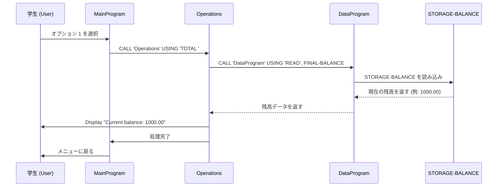
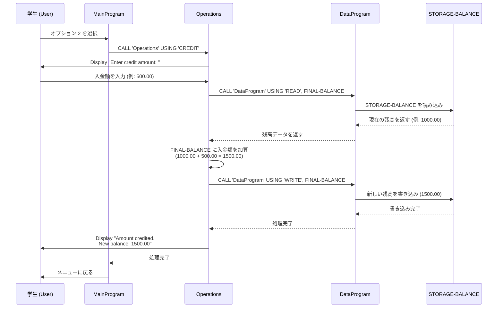
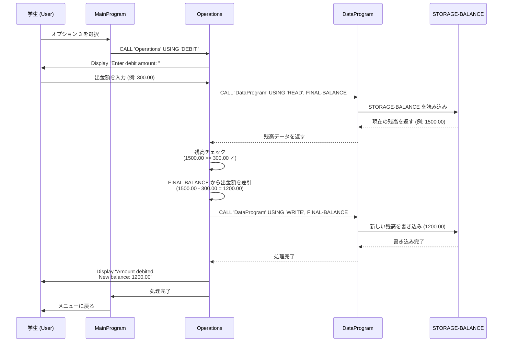
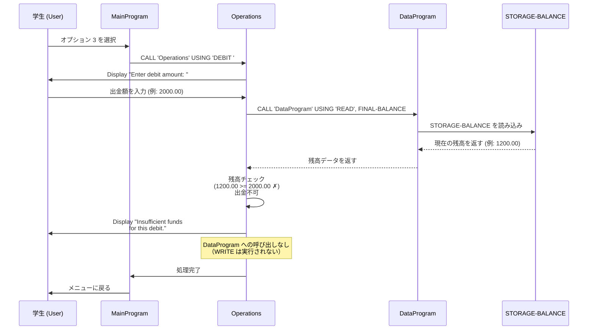

# COBOLレガシーコード ドキュメント

このディレクトリは、学生向けアカウント管理システムのCOBOLレガシーコードに関する技術ドキュメントを包含しています。

---

## 概要

このシステムは、学生アカウントの残高管理を行う3層アーキテクチャで構成されています。


## ファイル構成

### 1. **main.cob** - メインプログラム (MainProgram)

**目的**  
ユーザーインターフェース層として機能し、学生アカウント管理システムのエントリーポイントです。メニュー主導型のインタラクティブなインターフェースを提供します。

**主要な機能**
- ユーザーメニューの表示と入力管理
- 操作ループ制御 (`PERFORM UNTIL`)
- ユーザーの選択に基づいたプログラム呼び出し

**ビジネスロジック**
| オプション | 機能 | 説明 |
|----------|------|------|
| 1 | View Balance | 現在の口座残高を表示 |
| 2 | Credit Account | 金額をアカウントに加算 |
| 3 | Debit Account | 金額をアカウントから差し引く |
| 4 | Exit | プログラムを終了 |

**主要変数**
- `USER-CHOICE` (PIC 9): ユーザーの選択入力
- `CONTINUE-FLAG` (PIC X(3)): プログラム継続フラグ

---

### 2. **operations.cob** - オペレーションプログラム (Operations)

**目的**  
ビジネスロジック層として機能し、アカウント操作の具体的な実装を担当します。残高の表示、入金、出金処理を実行します。

**主要な機能**
- `TOTAL` オペレーション：現在の残高をDataProgramから取得して表示
- `CREDIT` オペレーション：入金処理の実行
- `DEBIT` オペレーション：出金処理の実行（残高チェック付き）
- DataProgram との連携による永続的なデータ管理

**ビジネスルール**

#### CREDIT（入金）
1. ユーザーに入金額の入力を要求
2. DataProgramから現在の残高を読み込み
3. 入金額を残高に加算
4. 更新された残高をDataProgramに書き込み
5. 新しい残高を表示

```cobol
例: 残高 1000.00 + 入金 500.00 = 新残高 1500.00
```

#### DEBIT（出金）
1. ユーザーに出金額の入力を要求
2. DataProgramから現在の残高を読み込み
3. **残高チェック**：出金額 ≤ 現在の残高か確認
   - チェック成功：出金を実行し、新しい残高を書き込み
   - チェック失敗：エラーメッセージを表示（出金不可）
4. 処理結果と新しい残高を表示

```cobol
例1: 残高 1000.00 - 出金 300.00 = 新残高 700.00 ✓ 成功
例2: 残高 1000.00 - 出金 1500.00 = エラー ✗ 残高不足
```

**主要変数**
- `OPERATION-TYPE` (PIC X(6)): 実行するオペレーション種別
- `AMOUNT` (PIC 9(6)V99): 入出金額
- `FINAL-BALANCE` (PIC 9(6)V99): 現在の残高

**主要変数**
- `PASSED-OPERATION` (PIC X(6)): 呼び出し元から渡されるオペレーション種別

---

### 3. **data.cob** - データプログラム (DataProgram)

**目的**  
データ層として機能し、学生アカウントの残高データの永続化と読み書きを管理します。他のプログラムから呼び出され、データアクセスを一元管理します。

**主要な機能**
- アカウント残高の初期化と保管
- `READ` オペレーション：残高データの読み込み
- `WRITE` オペレーション：残高データの更新

**ビジネスルール**

#### データの初期化
- `STORAGE-BALANCE` は初期値 **1000.00** で設定されます
- これは新規学生アカウントの初期残高です

#### READ オペレーション
指定された変数に `STORAGE-BALANCE` の値をコピーします。
```cobol
他プログラムが現在の残高を取得する場合に使用
```

#### WRITE オペレーション
受け取った残高値を `STORAGE-BALANCE` に保存し、永続化します。
```cobol
他プログラムが残高を更新した場合に使用
```

**主要変数**
- `STORAGE-BALANCE` (PIC 9(6)V99): 学生アカウントの残高（初期値: 1000.00）
- `PASSED-OPERATION` (PIC X(6)): 実行するオペレーション（READ/WRITE）
- `BALANCE` (PIC 9(6)V99): 呼び出し元とのデータ交換変数

---

## システム フロー

```
[ MainProgram ]
     ↓
  ユーザー入力
     ↓
[ Operations ]
     ↓
[ DataProgram ]
     ↓
STORAGE-BALANCE（データ層）
```

1. **MainProgram** がメニューを表示してユーザー入力を受け付ける
2. ユーザーの選択に基づいて **Operations** を呼び出す
3. **Operations** がビジネスロジックを実行
4. 必要に応じて **DataProgram** を呼び出して残高を読み書き
5. 処理結果をユーザーに表示

---

## 学生アカウント関連の業務ルール

### 1. 初期残高
- 新規学生アカウントは **1000.00** の初期残高で開設されます
- この値は `DataProgram` の `STORAGE-BALANCE` に定義されています

### 2. 入金（クレジット）
- 学生は任意の金額を入金できます
- 入金額に上限制限はありません
- 入金は即座に記録されます

### 3. 出金（デビット）
- **残高以上の出金は認められません**
- システムは出金前に残高チェックを実行します
- 残高不足の場合、出金トランザクションを拒否します

### 4. 残高表示
- 学生はいつでも現在の残高を確認できます
- 表示される残高は常に最新の値です

### 5. サポートされるデータ有効期限
- アカウント残高は大型整数型（6桁）で管理されます
- 小数第2位まで対応（例: 1234.56）
- 最大対応額: 999999.99

---

## 技術的な注意事項

### メモリ管理
- `STORAGE-BALANCE` はプログラム実行期間中、メモリに保持されます
- プログラム終了時にデータは保存されません

### マルチユーザー対応
- 現在のシステムはシングルユーザーで設計されています
- 同時アクセス制御機構は実装されていません

### エラーハンドリング
- 無効な入力値（負数など）の検証は現在実装されていません
- 今後の改善対象として検討してください

---

## 更新履歴

| 日付 | 更新内容 |
|------|---------|
| 2026-03-27 | ドキュメント初版作成 |

---

## シーケンスダイアグラム - データフロー

以下のダイアグラムは、各操作における学生ユーザー、メインプログラム、オペレーションプログラム、データプログラム間のデータフローを示しています。

### 1. 残高表示フロー (View Balance)



### 2. 入金フロー (Credit Account)



### 3. 出金フロー (Debit Account) - 成功ケース



### 4. 出金フロー (Debit Account) - 失敗ケース（残高不足）



---

## データフロー解説

### キーポイント

1. **階層化されたアーキテクチャ**
   - **プレゼンテーション層**: MainProgram がユーザーインタラクション管理
   - **ビジネスロジック層**: Operations がルール判定と処理実行
   - **データアクセス層**: DataProgram が永続化を管理

2. **データ交換メカニズム**
   - `LINKAGE SECTION` を用いたプログラム間通信
   - `USING` 句でパラメータを受け渡し
   - `GOBACK` で呼び出し元に制御を返す

3. **残高チェック（重要なビジネスルール）**
   - 出金時に事前チェック実行
   - チェック失敗時は DataProgram を呼ばない（エラーハンドリング）

4. **データ永続化**
   - READ: `STORAGE-BALANCE` → プログラム変数へ読み込み
   - WRITE: プログラム変数 → `STORAGE-BALANCE` へ書き込み
